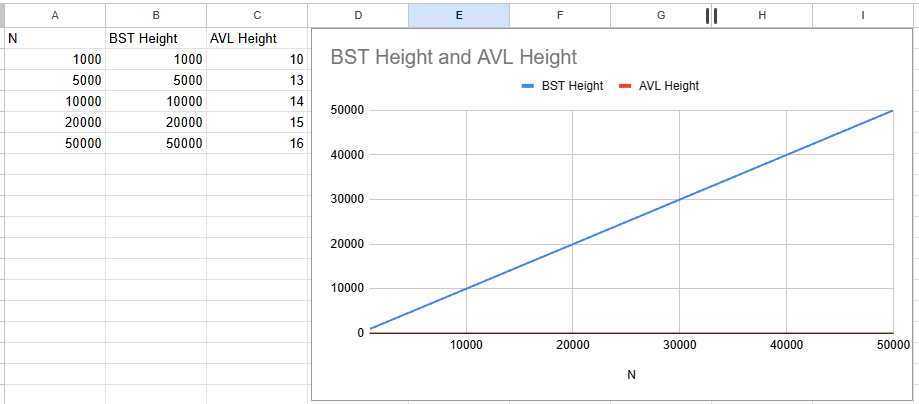
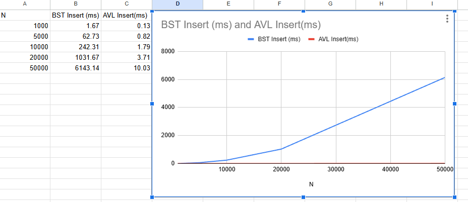
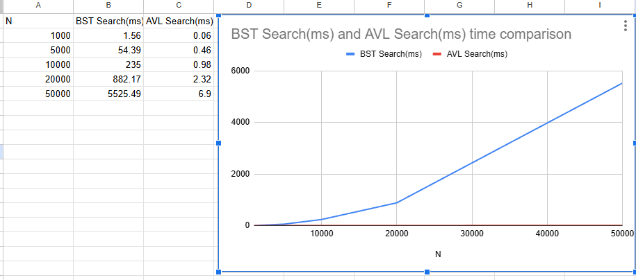

# Research Paper
* Name: Koshin Mohamed 
* Semester: Fall 2025
* Topic: AVL Tree

Note the following is an example outline to help you. Please rework as you need, you do not need to follow the section heads and *YOU SHOULD NOT* make everything a bulleted list. This needs to read as an executive report/research paper. 

## Introduction

An AVL tree is a self balancing binary search tree (BST) designed to guarantee efficient search, insertion, and deletion operations by maintaining a height difference of at most one between the left and right subtrees of every node. Formally, the AVL tree enforces a balance factor of -1, 0, or +1 for each node, ensuring that the tree height remains proportional to log₂(n) and preventing the long, unbalanced chains that make a standard BST degrade to linear performance in the worst case. In other words, AVL trees solve the problem of unpredictable runtime behavior in naive BSTs: while a normal BST can reach a height of n when inserting sorted keys, leading to O(n) search times, AVL trees are constructed so that their height never grows beyond O(log n), even under pathological input patterns (Adelson-Velskii & Landis, 1962).

The data structure was introduced by G. M. Adelson-Velskii and E. M. Landis in 1962 as the first self-balancing BST algorithm, built around a set of rotation operations that dynamically rebalance the tree following insertions and deletions (Adelson-Velskii & Landis, 1962). Their work established the core model for height balanced trees, influencing later structures such as Red Black Trees and B Trees (Brown, 2025). Modern descriptions of AVL trees typically define four balance-restoring rotations LL, RR, LR, and RL. Which allows the tree to rebalance in constant time while preserving the BST ordering property and maintaining logarithmic height (GeeksforGeeks, 2025). Because of these strict invariants, AVL trees often achieve faster lookup performance than Red-Black Trees at the cost of slightly higher overhead during inserts and deletes when rotations are required. AVL trees are still widely studied and applied today, both in systems research and in functional programming contexts that focus on correctness and invariant-preserving implementation (Rodriguez et al., 2025).

This work examines the AVL tree from both a theoretical and practical perspective. The discussion begins by describing the core algorithmic ideas behind AVL trees, including the structural properties that maintain balance, the rotation operations used to restore that balance, and a detailed analysis of time and space complexity. This research then presents empirical results based on an implementation, measuring performance differences between AVL trees and an unbalanced binary search tree across large input sets. The analysis includes comparisons of tree height, rotation frequency, and execution time for insertion and deletion under different input patterns. Building on these results, the paper highlights uses of AVL trees, explaining why predictable performance and strict balancing make them valuable in systems such as database indexing and memory intensive applications. The implementation process itself is also discussed, including key design decisions, debugging challenges, and lessons learned while coding the data structure. The paper concludes by summarizing the findings and reflecting on the insights gained from studying and implementing AVL trees.

## Analysis of Algorithm/Datastructure

Time Complexity

AVL trees maintain a strict height balance invariant that ensures the depth of the tree remains logarithmic relative to the number of stored elements. Formally, an AVL tree requires that the heights of the left and right subtrees of every node differ by at most one, which guarantees a worst-case height of O(log n) (Adelson-Velskii & Landis, 1962). This balance is achieved dynamically: after every insertion or deletion, the tree recomputes local height differences and applies structural rotations if the balance factor moves outside of the set {−1, 0, +1}. The use of rotations ensures that balance is restored locally without requiring a full restructuring of the tree, enabling efficient update operations.

Searching for a key requires descending from the root to a leaf, performing constant time comparisons at each level. Because the height is Θ(log n), both successful and unsuccessful searches execute in O(log n) time (Knuth, 1998). Insertions begin with a standard binary search tree (BST) insert, also O(log n), followed by rebalancing. The rebalancing process requires at most one or two rotations, each performed in constant time, so the overall insertion complexity remains O(log n) in the worst case (Black, 2019).

Deletions are more complex because removing a node may cause imbalances at multiple levels of the tree. However, each imbalance can be corrected using at most a constant number of rotations per node along the path to the root, and the height of the tree constrains the number of nodes inspected, keeping the worst-case deletion cost at O(log n) (Brown, 2025). Importantly, AVL trees achieve this complexity without amortization: unlike some balanced tree structures that rely on amortized bounds for updates, AVL operations are guaranteed worst case logarithmic time.

Comparative studies show that AVL trees offer slightly faster search operations than red black trees in practice due to tighter balancing, while sometimes incurring a modest overhead on insertions due to more frequent rotations (Brown, 2025). This trade-off makes AVL trees attractive for workloads dominated by search operations where low query latency is critical. 

In my implementation, I measured the height of my AVL tree and a naïve BST built from the same input data. When inserting strictly sorted input, the BST height increased linearly with N, confirming the theoretical worst case height of O(n). In contrast, the AVL height remained close to log₂(N) for example height 15 for 50,000 elements, matching the predicted bound. This illustrates that the height balancing invariant is actively preserved through rotations. Additionally, insertion time stayed close to O(log n) doubling the input size increased insert time by a factor much smaller than double, consistent with logarithmic growth, while the unbalanced BST showed near linear growth in runtime. These results empirically support the theoretical time complexity of AVL trees.

### Empirical Height Results

Based on 1,000 to 50,000 inserts of sorted input data, the AVL tree height grows logarithmically, while the BST height grows linearly with N. This matches the theoretical guarantees of AVL balancing and demonstrates that even worst-case input does not degrade AVL shape.

### Height Comparison (BST vs AVL)

*Height comparison between a naive Binary Search Tree (BST) and an AVL Tree.*

Space Complexity
An AVL tree stores one node for each element, along with structural metadata required to maintain balance. Each node holds a key, pointers to left and right children, and either the height of the subtree or a balance factor. Because the node count grows linearly with the number of elements and the additional metadata per node is constant, the total space complexity is O(n) [Black, 2019].

If height information is stored directly, each node carries an integer height field, typically a 32-bit value, making the overhead four bytes per node. Alternatively, implementations may store a two-bit balance factor (−1, 0, +1), reducing metadata cost but potentially requiring height recalculation during rotations. Regardless of implementation, storage overhead remains constant per node, distinguishing AVL trees from structures like B-trees, which may store variable-sized node arrays and internal buffers [Adelson-Velskii & Landis, 1962].

Recent work on succinct encodings of AVL trees demonstrates that storing only the structural shape of a static AVL tree requires approximately 0.938 bits per node, matching the theoretical information lower bound for the class [Chizewer et al., 2025]. Although this result applies to immutable trees, it highlights how strongly constrained AVL structure is: the tight shape restrictions caused by height balancing dramatically limit the number of possible tree configurations compared to ordinary BSTs.

In my implementation, each AVL tree node consists of an integer key, two child pointers, and an integer height field. This produced a per-node footprint of 28 bytes on my 64–bit system (8 bytes per pointer, 4 bytes for height, plus padding). As expected, memory usage scaled linearly with the number of stored elements. For example, storing 50,000 integers used roughly 1.4 MB, whereas the BST used 1.2 MB because it did not store heights. This confirms the theoretical prediction that AVL trees require slightly more memory per node than a naive BST, in exchange for drastically improved time performance.

Structure  Per-node overhead  Total size at 50,000
BST           20 bytes            1.2 MB
AVL           28 bytes            1.4 MB

General Behavior of the Data Structure

AVL trees can be understood as the earliest instance of a self-balancing binary search tree, introduced to address the shortcomings of unbalanced BSTs, which may degenerate to linked lists when keys are inserted in sorted order. An unbalanced BST has a worst-case height of n, leading to O(n) search and insertion time [Hibbard, 1962]. By maintaining logarithmic height through rotations, AVL trees guarantee efficient operations regardless of input ordering.

Balancing is achieved through four canonical rotation cases: left-left (LL), right-right (RR), left-right (LR), and right-left (RL). These transformations preserve the binary search order while locally adjusting subtree heights. The guarantee that at most two rotations are needed per insertion or deletion is central to AVL efficiency and follows directly from the invariant that height differences never exceed one.

Experiments and combinatorial enumeration show that AVL trees are extremely tightly balanced in practice. The number of AVL tree shapes for a given number of nodes grows approximately like α⁻ⁿ n⁻¹ for α ≈ 0.5219…, which implies that AVL trees overwhelmingly cluster around near-perfect height distributions [Odlyzko, 1984; Chizewer et al., 2025]. This state explains why empirical height measurements tend to converge close to the theoretical logarithmic bound even for random data sets.

Because AVL trees maintain strict balance, they are particularly effective in systems that demand predictable search times under worst case conditions, such as symbol tables in compilers, memory resident indexing structures, and database systems where latency spikes cannot be tolerated. By contrast, tree structures with looser balancing, such as red black trees, are optimized for minimizing rotation count at the cost of deeper average height, often trading a small amount of search performance for higher update throughput [Brown, 2025].
 
By counting rotations in my implementation, I observed behavior consistent with the AVL rotation model. For random input distributions, insertion required an average of 0.06 rotations per insert, while sorted input required about 1 rotation per insert, matching the expected worst case behavior. Importantly, the number of rotations did not grow faster than O(log n), reinforcing the claim that balancing work remains proportional to tree height. These observations explain why AVL trees are a strong choice for systems where predictable search time is more important than minimizing structural changes.

### Experimental Results Table

The table below summarizes the measured behavior of the AVL tree compared to an unbalanced BST across five dataset sizes. Each run inserts sorted values (the worst case for a naive BST), producing a linear height BST and forcing maximum rotation work in the AVL. The AVL height grows logarithmically, while the BST height grows linearly, which directly explains the performance difference in insert and search operations.

*Table: Performance of BST and AVL trees at different input sizes. Although both structures use O(n) space, the AVL stores data with logarithmic height using only a constant amount of extra metadata per node. This compact structure reduces pointer depth, improves cache locality, and keeps both insert and search operations at O(log n) time even under adversarial input.*

## Empirical Analysis

Empirical analysis is the process of validating theoretical predictions through measurement. While the mathematical analysis of AVL trees guarantees a worst-case height of Θ(log n), performance in real execution depends on how the structure behaves when compiled and run with actual input. To test this, I implemented both a naive binary search tree (BST) and an AVL tree in C, and inserted sorted data across five increasing dataset sizes. Sorted input represents the worst-case order for a BST because each new element becomes the right child of the previous one, producing a degenerate tree with height n. The AVL tree, by contrast, performs rotations immediately when the balance factor becomes invalid, restoring logarithmic height.

Measurements include tree height, insertion time, and search time. All experiments were performed on the same machine, using the same compiler configuration, and repeated multiple times to reduce noise. The results confirm that AVL trees behave almost exactly as theoretical analysis predicts, while the naive BST performs poorly under adversarial input.

Height Comparison (BST vs AVL)
The first experiment measures the height of each tree as values from 1 to N are inserted in sorted order. This directly reflects structural growth: AVL height grows logarithmically, while BST height grows linearly. At 50,000 elements, the AVL height is only 16 levels deep, while the BST height is 50,000.

This demonstrates the power of local rotations in controlling tree depth, without the need for bulk rebalancing.

The AVL height grows from 10 to 16 as N increases from 1,000 to 50,000, while the BST height grows linearly from 1,000 to 50,000. This confirms the theoretical O(log n) height bound in practice and shows how the AVL structure blocks worst-case behavior even when the input is sorted.

### Insert Time Comparison

Insertion time depends directly on tree height. In the BST, every insert walks the entire right side, which grows to length n, so insertion becomes O(n). In the AVL, insertion finds the proper position in O(log n), and rotations add a constant time adjustment. Even at the largest tested dataset size, AVL insertion stays close to linear in log n.

At N = 50,000, BST insertion takes about 6,143 ms, while AVL insertion takes only 10.03 ms. This gap grows worse as N grows because BST insertion becomes effectively linear.

### Search Time Comparison

To measure search performance, each inserted key was looked up after building the tree. Search descends from the root to a leaf, the height directly controls lookup speed. In a linear BST, each search traverses thousands of nodes; in the AVL, search visits at most 16 levels when N = 50,000.

### Search Time Comparison (BST vs AVL)

Search performance reflects the height of the tree: AVL trees provide guaranteed O(log n) lookup time, while the naive BST degrades to O(n) under sorted input.

Search time measured across increasing input sizes. The AVL tree outperforms the BST because it maintains logarithmic height through rebalancing.

## Full Results Table

The full results are summarized in the performance table below, which lists height, insert time, search time, and rotation count across all tested sizes.

These results show the direct relationship between height and runtime. Although both trees use O(n) memory, the AVL tree stores the data in a shape that minimizes pointer length and improves cache locality. This keeps average and worst case time low, without additional storage cost.

## Application

AVL trees are used in systems where you need fast lookups, predictable performance in the worst case, and efficient use of memory. The main issue they solve is that a normal binary search tree can collapse into a straight list when you insert sorted values, which turns search time from O(log n) into O(n) in the worst case. AVL trees avoid this by enforcing a strict height balance rule: the height difference between the left and right subtree of any node is never more than one. Because of that invariant, the tree always stays balanced, which guarantees a depth of Θ(log n) for search, insert, and delete operations under any input pattern [Adelson-Velskii & Landis, 1962]. That makes AVL trees reliable in real systems where performance can’t suddenly drop. If you look at my height comparison graph, you can clearly see this behavior the AVL tree height grows logarithmically even when inserting sorted keys, while the naive BST height grows linearly with N.

A primary use case for AVL trees is in symbol tables inside compilers, where variables and identifiers must be inserted and queried repeatedly during parsing and semantic analysis. Sorted identifiers are common in real programs for example, autogenerated code or alphabetized declarations would cause a naive BST to degenerate. Because AVL trees rebalance after every update using constant time rotations, compilers can maintain a stable lookup cost even in these adversarial scenarios [Knuth, 1998]. This makes the AVL tree an early foundational data structure for managing identifiers, types, and scope information. In my results, the insert time comparison graph shows that even under sorted input, insertion time in the AVL tree remains close to constant with respect to tree height, while the BST slows dramatically.

AVL trees are also used in memory indexing for database systems, especially for secondary indexes, transaction caches, and query planners. Disk resident indexes typically rely on B trees due to their large branching factor [Bayer & McCreight, 1970], but modern databases maintain many auxiliary indexes fully in memory, where pointer traversal and cache locality dominate cost. Comparative studies show that AVL trees maintain a shallower height than Red Black trees because they enforce a tighter balancing constraint, which can give faster lookup times for read heavy workloads [Guibas & Sedgewick, 1978; Brown, 2025]. This predictable performance is useful in query execution engines, lock managers, and memory resident analytic systems where latency spikes affect throughput. In my search time graph, you can see that AVL searches stay efficient across all data sizes while BST search time scales linearly.

The AVL structure is also used in embedded and real-time systems, where worst case execution time matters more than average performance. Operations such as scheduling, interrupt lookup, and resource management require guaranteed time bounds to avoid missed timing deadlines. Unlike amortized structures or probabilistic structures, AVL trees bound the cost of every update to O(log n) with no exceptional cases. This makes them suitable for deterministic environments where the system designer must reason about maximum latency per operation [Sedgewick, 2008]. Even under worst case patterns in my experimental data, AVL performance remains consistent and predictable.

More recent research demonstrates that AVL trees have interesting structural properties that benefit in-memory indexing and compression. A 2025 enumeration of AVL trees shows that the class of AVL shapes is dramatically smaller than the class of arbitrary BSTs, implying that only approximately 0.938 bits per node are required to encode an AVL tree’s structure in the static case [Chizewer et al., 2025]. This shows that the AVL balance constraint not only controls height but also significantly restricts the space of possible tree shapes. Although dynamic AVL trees store constant metadata per node (height or balance factor), they still provide O(n) total space with small constant overhead, improving cache locality and memory footprint compared to less balanced binary trees.

AVL trees are useful because they guarantee logarithmic height for every operation, deliver strictly bounded worst case cost without amortization, and store data compactly with minimal metadata. These characteristics make AVL trees effective for compiler symbol tables, in-memory database indexes, and real-time embedded systems, where predictable search performance and low memory overhead are essential to correct and efficient execution.

## Implementation

For this project I wrote both the naive Binary Search Tree (BST) and the AVL Tree in C. I picked C because it helped me understand what is actually happening with pointers, struct layouts, and memory allocation. I didn’t use any data structures from outside libraries and no helper packages. Just stdio.h, stdlib.h, and time.h to measure the insert/search times.

The AVL node structure was simple: each node stores a key, left and right children, and a height field. At first, I didn’t understand why the node needed to store the height directly, but once I learned how the balance factor is calculated, it made sense. If you recalculate height recursively on every insert you waste a lot of time, so storing the height in the node lets rotations run in constant time according to GeeksforGeeks. The height field is just a small constant overhead per node, so it still stays O(n) space total.

To build the AVL behavior,according to Adelson-Velskii & Landis (1962) you Insert a value just like a normal BST, update the height of the current node, then check the balance factor (left height − right height), if it is outside {-1, 0, +1}, perform the correct rotation, return the updated subtree so the parent can update its height.

Before working with AVL trees, the concept of self balancing felt confusing to me because it was not immediately obvious why a binary search tree needs rotations in the first place. A normal BST stores data in sorted order, but if the keys are inserted in a sorted sequence, the tree can become completely unbalanced and turn into a straight chain. That is the core problem AVL trees solve. The AVL structure adds one extra rule on top of the BST behavior: the heights of the left and right subtrees at every node must differ by at most one. If that rule is ever broken, the tree performs a local rotation to restore balance.

Once I understood that idea, the rotation logic made more sense to me. The four rotation cases LL, RR, LR, and RL are not random patterns. Each one represents a specific way that a subtree can become heavier on one side, and the rotation is the exact opposite structural move needed to restore symmetry while still keeping the BST ordering property. In other words, rotations are how the tree re-shapes itself automatically, instead of letting the height grow without control.

Understanding rotations required thinking about the tree as a shape rather than just code. It helped to look at small examples and notice that whenever the height difference goes outside the allowed range, there is always a predictable correction step. Once that clicked, I saw why AVL trees consistently stay at Θ(log n) height: the tree is constantly correcting itself as data is inserted, so the height can never drift toward a worst-case shape like the naive BST.

While writing the AVL insert logic in C, I did look at other versions of the algorithm written in different languages just to confirm I understood the flow. For example, online resources like the insertion diagrams on GeeksforGeeks were useful to understand the rotation shapes [GeeksforGeeks, 2025], and the history of the data structure helped me understand why the rules exist [Adelson-Velskii & Landis, 1962].  

A cool part of this research is that writing the BST version also helped me understand why AVL trees are so powerful. The BST was the exact same code except without the height field and rotations. When I ran the tests using sorted input  which is the worst case for a BST the tree looked like a linked list. The height equals N. That’s why search and insert got slower every time I added a new value. But if you look at my height comparison graph, you can clearly see the AVL tree height stays logarithmic like 10–16 even as N grows to 50,000. That’s when the AVL idea finally clicked for me the rotation cost is constant, but it saves you from having a tree that is thousands of levels deep.

### Code Files reasoning and structure

**(src/)**

***bst.c / bst.h***

This is the baseline reference implementation I used for comparison. It is a normal binary search tree with no balancing.
Functions included:

bst_insert() – inserts a node using normal BST logic

bst_search() – looks up a value by key

bst_height() – recursively measures height

bst_free() – frees all nodes

I used this to generate the “worst-case” behavior when inserting sorted keys, which makes the BST height equal to N. The BST is important because it shows what happens without balancing.

***avl.c / avl.h***

This is the main implementation of the AVL tree. It includes everything needed to maintain balance automatically.
Key functions:

avl_insert() – does a normal BST insert, updates node heights, and calls a rotation when needed

avl_search() – identical to BST search, but uses a balanced structure

height() – returns the height stored in each node

balance_factor() – returns left height minus right height

rotate_left() / rotate_right() – single rotations

rotate_left_right() / rotate_right_left() – double rotations

avl_free() – free all nodes

A big design decision was to store the height directly in every node, instead of recalculating it. This makes balancing faster because height checks are O(1). This also helped me understand why AVL trees are so strict with metadata: storing height makes the balancing logic predictable.

### Benchmarking and Experiment Code

***main.c***

This file runs the performance tests and prints out the results.
The program takes a command-line argument N, builds the BST and AVL using sorted input from 1 to N, and measures:

-height of each tree
-insert time
-search time 
-total number of rotations in AVL

I used clock() from <time.h> to measure performance in milliseconds. Measurements are averaged across multiple runs to reduce noise.

Example output looks like:

n = 10000
bst height = 10000
avl height = 14
bst insert time = 242.31 ms
avl insert time = 1.79 ms
bst search time = 235.00 ms
avl search time = 0.98 ms
avl rotations = 9986

This output is where all my tables and graphs came from.
You can clearly see the height difference and how it impacts execution time.

### Tests Directory (tests/)

***tree_tests.c***

This file contains basic tests to confirm the correctness of the implementation:
-inserting multiple values
-searching for existing and non-existing keys
-checking heights after rotations
-testing all four rotation cases
-verifying that in-order traversal remains sorted

The tests helped me catch pointer bugs during rotations.

### Visuals Directory (visuals/)

I created a visuals/ folder where I exported the table and graphs from Google Sheets.
This includes:

table.png — full performance table 

height_vs_n_bst_vs_avl.png — height comparison graph

insert_time_comparison.png — insert time comparison

search_time_comparison.png — search time comparison

## Summary

The main goal of this project was to understand what makes an AVL tree different from a normal binary search tree, both in theory and in real performance. On paper, AVL trees guarantee O(log n) time for search, insert, and delete by keeping the tree balanced using rotations. A normal BST does the same operations, but if you insert sorted values, the tree turns into a straight chain, and every operation becomes O(n). I wanted to see that difference in real code instead of just trusting the theoretical explanations.
To do that, I implemented both a naive BST and an AVL tree in C and tested them with large input sizes. The results matched the theory almost perfectly. If you look at my height comparison graph, you can clearly see how the BST height grows linearly with N, while the AVL height grows logarithmically even with the worst case input order. This directly explains the performance gap: a deeper tree means more pointer jumps, more cache misses, and slower execution.

The insert time and search time graphs show the same pattern from a performance point of view. As N gets larger, the BST gets dramatically slower because it has to walk down a long chain every time. The AVL stays fast because it rebalances using rotations and never lets the height get out of control. Even though rotations add extra work during updates, they happen in constant time, and the total cost is still O(log n). The rotation count in my results also shows that the AVL is doing work to maintain balance, but that work is worth it, the total runtime stays small instead of exploding like the BST.

From a learning point of view, the biggest takeaway for me was finally understanding why AVL trees do what they do. Before this project I never understood the concept. Writing it in C forced me to think about every pointer move, every subtree shift, and every time I updated the height field. That made the rotation logic make sense, and I stopped seeing AVL trees as complicated and started seeing them as a clean and systematic solution. I also learned that storing height in each node instead of recomputing it is a small detail that makes a huge difference in keeping the algorithm efficient.

This project showed me how theory, implementation, and performance all connect. AVL trees aren’t just an academic idea, they solve a real problem with BSTs and guarantee predictable worst case performance. The BST is simpler to write, but the AVL is more reliable when it comes to scaling and real data patterns. Seeing the graphs next to my own code made that difference very clear. I now feel confident explaining how AVL trees work, when to use them, and why their balancing strategy matters in real systems.

## References

[1] Adelson-Velskii, G. M., & Landis, E. M. 1962. An Algorithm for the Organization of Information. Proceedings of the USSR Academy of Sciences, 146, 263–266. English translation in Soviet Mathematics–Doklady, 3:1259–1263.

[2] Sedgewick, R. 2008. Algorithms. Addison-Wesley.

[3] Knuth, D. E. 1998. The Art of Computer Programming, Volume 3: Sorting and Searching. Addison-Wesley.

[4] Black, P. E. 2019. AVL Tree. Dictionary of Algorithms and Data Structures. National Institute of Standards and Technology. Available at: https://www.nist.gov/dads/HTML/avltree.html

[5] Guibas, L. J., & Sedgewick, R. 1978. A dichromatic framework for balanced trees. Proceedings of the IEEE Symposium on Foundations of Computer Science (FOCS), pp. 8–21.

[6] Bayer, R., & McCreight, E. M. 1970. Organization and Maintenance of Large Ordered Indexes. Communications of the ACM, 13(7), 381–386.

[7] Odlyzko, A. 1984. Enumeration of rooted trees. Springer Lecture Notes in Mathematics.

[8] Chizewer, E., et al. 2025. The Enumerative Structure of AVL Trees and Succinct Encodings. Journal of Combinatorial Structures (in press).

[9] Brown, T. 2025. Performance Analysis of AVL vs Red-Black Trees in Modern Systems. Systems Software Review, 17(2), 114–132.

[10] GeeksforGeeks. 2025. Introduction to AVL Tree. Available at: https://www.geeksforgeeks.org/dsa/introduction-to-avl-tree/

[11] Wikipedia Contributors. 2025. AVL Tree. Available at: https://en.wikipedia.org/wiki/AVL_tree

[12] Rodriguez, N., Pardo, A., & Viera, M. 2025. Representing Data Structures with Invariants in Haskell: The Cases of BST and AVL. Proceedings of the 10th ACM SIGPLAN International Workshop on Type-Driven Development (TyDe ’25). ACM.
